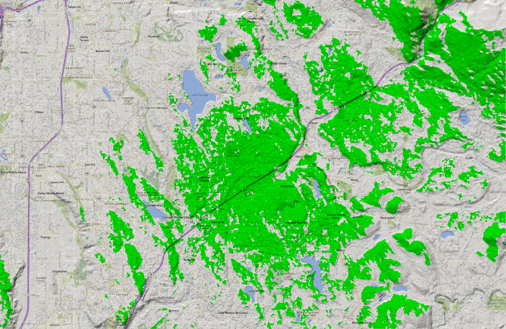

# Coverage

MapleMesh's coverage is focused on Maple Valley and the surrounding towns: Covington, Hobart, Ravensdale, Black Diamond, but coverage may stretch into other areas as we grow.

## Maps

You can expect reliable bidirectional connectivity (>70% of messages succeed) in green areas and occasional connectivity in yellow areas. Some of our routers (especially the backbone routers) run at higher power levels (1W / 30dBm) or into high-gain antennas, so the range that you can hear MapleMesh nodes at may exceed that which you can be heard from.

These maps assume someone using a common, portable node operating at standard power (0.15W / 22dBm) at 1.5m / 5' above ground level. If you are transmitting at higher power, have an antenna with gain, or are significantly higher than ground level, you are likely to have connectivity even in areas the maps indicate you wouldn't otherwise.

Note: these maps should be interpreted as any kind of guarantee, but our tests show they at least broadly conform to reality. If you are deep in a green area and getting no connectivity, feel free to reach out.

### Current
This is the coverage we expect to have active right now. 

### Permissed
This is the coverage we expect to have in the near future once we've installed every node that we have permission for.

## Process
Maps are created using [Radio Mobile for Windows](https://www.ve2dbe.com). To create ones in this style, use the following steps:
1. Configured all units correctly for their position, elevation, transceivers, antenna system parameters, and so on.
1. Overlay the InternetVirtualEarth map on the map with the *Operation* set to *Multiply*.
1. Repeat. This is the best way to get roads actually readable once you throw the coverage data on top.
1. Run your coverage for the node or nodes. 
  - Polar coverage is faster, but less precise. 
  - Cartesian coverage lets you combine multiple nodes' coverage as well as create Best Unit maps that differentiate between nodes' coverage instead of showing combined coverage.
